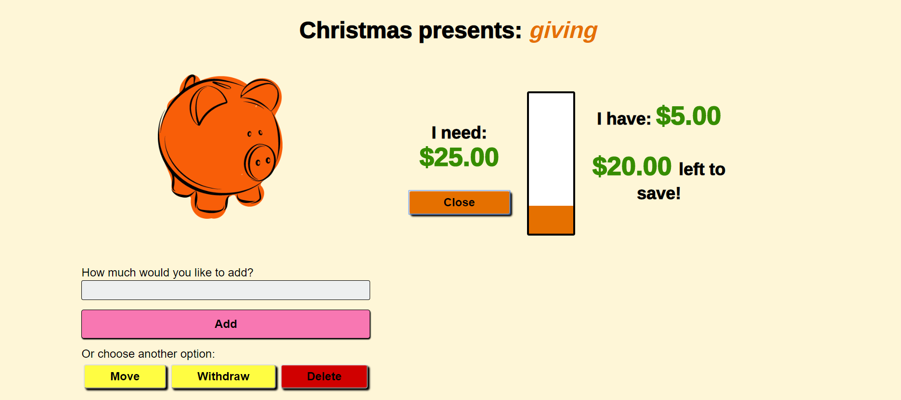

# Money Jars

## View it Live
https://money-jars.herokuapp.com/

## Server-side Code
https://github.com/Carenelizabeth/money-jars-server

## Motivation
I have been using a zero-based budgeting software called YNAB (You Need a Budget) for almost two years now and it has changed my life for the better. I keep track of less-frequent expenses and always have money set aside for when the car needs an oil
change or my son breaks his glasses for the 5th time this year.

I've been trying to teach my kids the same money habits that I have learned and give them allowance so that they can practice
budgeting now. We've used jars and envelop systems but I was getting really tired of always needing to have the correct amount
of cash on hand. When YNAB announced its new public API, I decided it was time to do something about it

## Summary
With Money Jars, parents set up an account and can choose to link it to YNAB or budget manually. They then register their children. Children can create and save for goals, moving money between their goals and make a withdrawal when they are ready for
a purchase (you'll have to be on hand to give them actually money for that part)

## Screenshots

**Landing page:**

**Parent Setup:**
Here, you can choose to authorize YNAB or select the 'budget manually' option
![Parent setup}(/public/screenshots/parent-setup.PNG)]

**Choose Budget:**
If you are a YNAB user, you will directed to choose the budget that you will be using with Money Jars

**Register Child:**
Registration looks slightly different for the two kinds of users.
For a YNAB user, you will select a category that will be used with your child's account

For a manual user, you will give your child a starting balance

**Child Dashboard**
When a child logs on, they will see their available balance and will be prompted to give that money a job

**Creating a Goal**
A goal is created with a name a target value, the choice of savings, spending or giving categories and an optional image url

**Goals**
Goals are displayed with a progress bar to give a visual representative of progress
]

**Goal Options**
The child can add or withdraw money from a goal, or move it between various goals

## Future Updates
There's almost too many to name! I have many ideas of where this could go, in order of priority
* More editing capability: Currently there is no way to edit a profile or a goal, aside from deleting it
* Parent reports: Parents can log on and see an overview of their children's goals and how they are allocating money
* Parent-approved withdrawing: When a child wants to withdraw money, it would create a request. The parent would see that when logged on and be able to approve the request. They could make the purchase or give the child cash and that would have to happen before the money was removed from the child's account. This should also sync as a transaction with YNAB
* Customization: The ability to customize goal categories, to allow children to transfer money only between categories or require them to put a specific percentage into each category, or to have no category goals at all

These are just a start but should keep me busy to a while!

## Technologies
* **frontend** ReactJS, Redux, CSS
* **testing** Express, Jest
* **integration** TravisCI